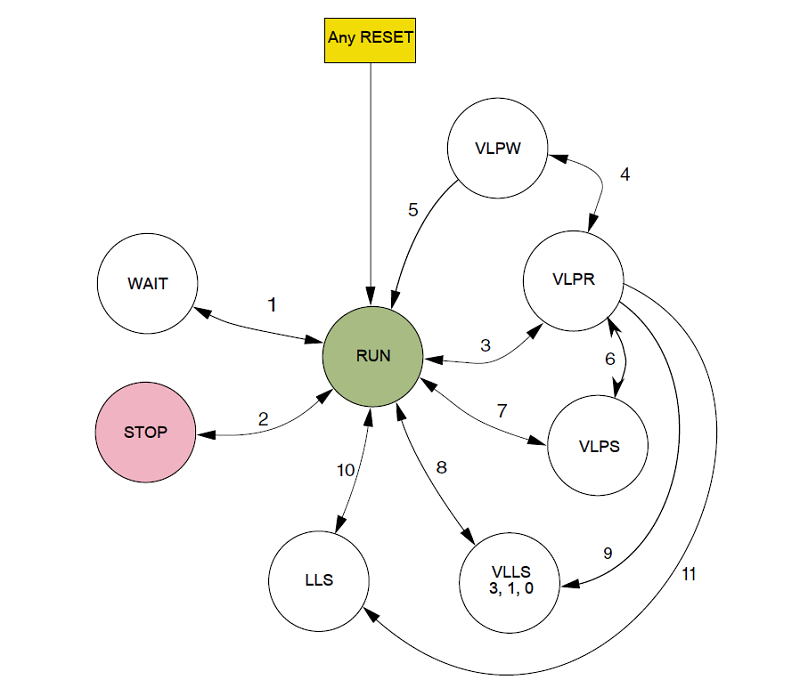

# NXP Application Code Hub

## MCXC444 Power Mode Switch Application
This is the complementary project for [AN14332](https://docs.nxp.com/bundle/AN14332/page/topics/introduction.html), which demonstrates various Low-Power modes of MCX C series with segment LCD display support.

The MCX C seires has the following power modes:

|Mode|CPU|SRAM|Peripherals|Wake-up Source|
|--|--|--|--|--|
|RUN|Active|Active|Active|*N/A*|
|WAIT|Sleep|Active|Active|NVIC|
|STOP|Deep Sleep|Retained|Clock Gated|AWIC|
|VLPR|Active (*)|Active (*)|Active (*)|*N/A*|
|VLPW|Sleep|Active|Active|NVIC|
|VLPS|Deep Sleep|Retained|Partial|AWIC|
|LLS|Deep Sleep|Retained|Partial|LLWU|
|VLLS3|Deep Sleep (Powered Down)|Retained|Partial|LLWU|
|VLLS1|Deep Sleep (Powered Down)|OFF|Partial|LLWU|
|VLLS0|Deep Sleep (Powered Down)|OFF|Partial|LLWU|

> (*): Maximum frequency limited.

> Refer to RM Table 7-2 for peripheral status under Low-Power modes.

The MCX C444 series features a low-power segment LCD controller which can operates at most low-power modes, provides rich display effects without the intervention of the CPU and other peripherals.

The SLCD peripheral can operates at the following power modes:

|__Mode__|RUN|WAIT|STOP|VLPR|VLPW|VLPS|LLS|VLLS3|VLLS1|VLLS0|
|--|--|--|--|--|--|--|--|--|--|--|
|SLCD Availability|✔|✔|✔ (*)|✔|✔|✔ (*)|✔ (*)|✔ (*)|✔ (*)|✗|

> (*): Asynchronous mode with 32kHz oscillator

#### Boards: FRDM-MCXC444
#### Categories: Low Power, HMI
#### Peripherals: DISPLAY
#### Toolchains: MCUXpresso IDE

## Table of Contents
1. [Software](#step1)
2. [Hardware](#step2)
3. [Setup](#step3)
4. [Results](#step4)
5. [FAQs](#step5) 
6. [Support](#step6)
7. [Release Notes](#step7)

## 1. Software
- Download and install [MCUXpresso IDE V11.10.0 or later](https://www.nxp.com/design/design-center/software/development-software/mcuxpresso-software-and-tools-/mcuxpresso-integrated-development-environment-ide:MCUXpresso-IDE).
- MCUXpresso for Visual Studio Code: This example supports MCUXpresso for Visual Studio Code, for more information about how to use Visual Studio Code please refer [here](https://www.nxp.com/design/training/getting-started-with-mcuxpresso-for-visual-studio-code:TIP-GETTING-STARTED-WITH-MCUXPRESSO-FOR-VS-CODE).

## 2. Hardware
This project uses FRDM-MCXC444 development kit available from NXP.

The following equipment/accessories are also required to run this demo:
* Personal computer
* USB Type-C cable

Optional equipment:
* Current meter / SMU (To measure power consumption during low power modes)

## 3. Setup
### 3.1 Hardware Setup
1. Connect the FRDM-MCXC444 board to PC through USB Type-C connector J13.

### 3.2 Software Setup - MCUXpresso IDE Project
1. Open MCUXpresso IDE, in the Quick Start Panel, choose **Import from Application Code Hub**    

2. Enter the demo name in the search bar.   

 

3. Click **Copy GitHub link**, MCUXpresso IDE will automatically retrieve project attributes, then click **Next>**.   

4. Select **main** branch and then click **Next>**, Select the MCUXpresso project, click **Finish** button to complete import.   

5. Click **Build** to start compiling the project.

## 4. Results
Please follow the Application Note ([AN14332](https://docs.nxp.com/bundle/AN14332/page/topics/introduction.html)) to perform the power mode switch and current measurement. The LCD will show the current power modes.

## 5. FAQs
No FAQs have been identified for this project.

## 6. Support
Please open a issue for support.

#### Project Metadata
<!----- Boards ----->

<!----- Categories ----->
 

<!----- Peripherals ----->

<!----- Toolchains ----->

Questions regarding the content/correctness of this example can be entered as Issues within this GitHub repository.

>**Warning**: For more general technical questions regarding NXP Microcontrollers and the difference in expected funcionality, enter your questions on the [NXP Community Forum](https://community.nxp.com/)

## 7. Release Notes
| Version | Description / Update                           | Date                        |
|:-------:|------------------------------------------------|----------------------------:|
| 1.0     | Initial release on Application Code Hub        | May 16th 2024 |

